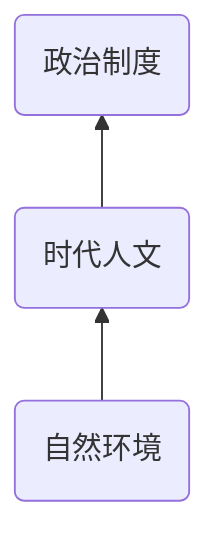

# 中国历代政治得失

钱穆写这本书原因：

- 政治是文化体系中一个重要的类目，要平心客观地检讨中国文化，传统政治无法绕开
- 中国历代政治不应该被“专制黑暗”四个字简单抹杀

## 朝代

- 汉
- 唐
- 宋
- 明
- 清

## 概述

政治制度的产生框架：

```mermaid
graph BT;
1(自然环境) --> 2(时代人文);
2(时代人文) --> 3(政治制度);
```

## 范围

- 政府组织
- 考试和选举
- 赋税制度
- 国防与兵役
