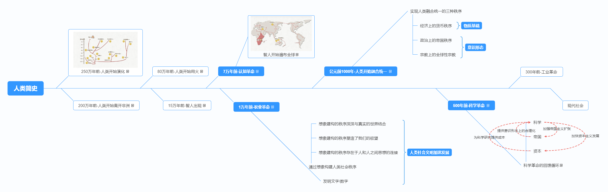

# 人类简史

## 认知革命

大约就是在距今7万到3万年前，出现了新的思维和沟通方式，这也正是所谓的认知革命。

得到普遍认可的理论认为，某次偶然的基因突变，改变了智人的大脑内部连接方式，让智人拥有了想象力，可以虚构出事物，更重要的是人们可以一起想象，编织出种种共同的虚构故事，从而可以集结大批人力、灵活合作。

认知革命之后，传说、神话、神以及宗教也应运而生。

## 农业革命

大约1万年前，人类开始驯化一些特定的植物（小麦，玉米，马铃薯，水稻等）和家畜，并且开始定居，逐渐形成永久村落，粮食供给增加，人口也开始迅速增长。通常农业部落人口远超采集部落。

慢慢地，人类发展出进阶的社会结构，如城市、王国、国家。

然而，智人的身体演化目的并不是为了从事农业活动。进入农业时代后，人类出现了大量疾病，例如椎间盘突出、关节炎和疝气。此外，新的农业活动得花上大把时间，人类就只能被迫永久定居在麦田旁边，这彻底改变了人类的生活方式。因此，换一个角度来看，其实不是我们驯化了小麦，而是小麦驯化了我们。

### 人类社会文明加速发展

#### 通过想象构建社会秩序

- 想象建构的秩序深深与真实的世界结合
- 想象建构的秩序塑造了我们的欲望
- 想象建构的秩序存在于人和人之间思想的连接

#### 发明文字和数字

## 融合统一

现代科学与先前的知识体系有三大不同之处：

1. 愿意承认自己的无知。现代科学的基础就是拉丁文前缀“ignoramus-”，意为“我们不知道”。从这种立场，我们承认了自己并非无所不知。更重要的是，我们也愿意在知识进展之后，承认过去相信的可能是错的。于是，再也没有什么概念、想法或理论是神圣不可挑战的。
2. 以观察和数学为中心。承认无知之后，现代科学还希望能获得新知。方式则是通过收集各种观察值，再用数学工具整理连接，形成全面的理论。
3. 取得新能力。光是创造理论，对现代科学来说还不够。它希望能够运用这些理论来取得新的能力，特别是发展出新的科技。

### 实现人类融合统一的三种秩序

- 经济 —— 货币秩序（物质基础）
- 政治 —— 帝国秩序（意识形态）
- 宗教 —— 全球性宗教（意识形态）

## 科学革命

- 科学
- 帝国
- 资本
